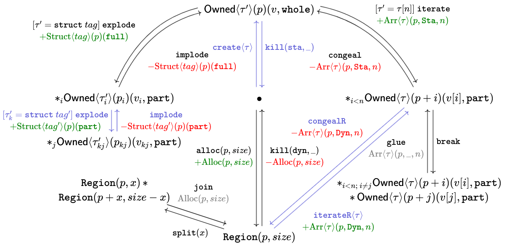

# Resource Operation Intuitions
---

The resource operations have fairly simple intutions behind them, which are lost
due to the complexity of all the book-keeping and constraint-checking that needs
to happen to accurately capture what's allowed.

## Quantified resources
---

Morally, the operations have the following type.

```
break : qpred -> qpred * pred (remainder + index)
glue : qpred * pred -> qpred
chop : qpred * iguard -> qpred * qpred
inj : pred -> qpred
```

`break` and `glue` are inverse operations, but `chop`'s inverse can't exist
because it would be undecidable (the constraint to express array merging in the
SMT language involves quantifiers).

Injecting into a singleton rather than empty because it
1. Guarantees all qpred_terms are non-empty; which
1. Guarantees the resource context/heap containing qpred_terms are also non-empty; which
1. Makes `{ _ : qpred_term' & oarg } |- qpred_term => qpred_term' & oarg` nicely consistent.
1. Also avoids the need to invent default-valued arrays in the SMT terms.

## Provenance
---

The design of the resources & operations to handle memory model, specifically
provenance, is constrained by the desire to (a) not send provenance information
the SMT solver, i.e. keep the SMT-representation of a pointer a simple integer
(b) similarly with integers (which is fine for PNVI, but does not work for VIP).

Here's a sketch.

[](https://q.uiver.app/?q=WzAsOCxbMCwzLCJcXG1hdGhzZntPd25lZH1cXGxhbmdsZVxcdGF1J1xccmFuZ2xlKHApKHYsIFxcdGV4dHR0e2Z1bGx9KSJdLFsxLDUsIlxcYXN0X2kgXFxtYXRoc2Z7T3duZWR9XFxsYW5nbGVcXHRhdV9pJ1xccmFuZ2xlKHBfaSkodl9pLCBcXHRleHR0dHtwYXJ0fSkiXSxbMSw2LCJcXGFzdF97an0gXFxtYXRoc2Z7T3duZWR9XFxsYW5nbGVcXHRhdV97a2p9J1xccmFuZ2xlKHBfe2tqfSkodl97a2p9LCBcXHRleHR0dHtwYXJ0fSkiXSxbMiwzLCJcXGFzdF97aSA8IG59IFxcbWF0aHNme093bmVkfVxcbGFuZ2xlIFxcdGF1IFxccmFuZ2xlKHAraSkodltpXSwgXFx0ZXh0dHR7cGFydH0pIl0sWzEsMSwiXFx0ZXh0dHR7UmVnaW9ufShwLCB7c2l6ZX0pIl0sWzEsMCwiXFx0ZXh0dHR7UmVnaW9ufShwLCB4KSBcXG1hdGhvcHtcXGFzdH0gIFxcdGV4dHR0e1JlZ2lvbn0ocCArIHgsIHNpemUgLSB4KSJdLFsyLDUsIlxcYXN0X3tpIDwgbjtcXCBpIFxcbmVxIGp9IFxcdGV4dHNme093bmVkfVxcbGFuZ2xlXFx0YXVcXHJhbmdsZShwICsgaSkodltpXSwgXFx0ZXh0dHR7cGFydH0pIFxcXFwgXFxtYXRob3B7XFxhc3R9IFxcdGV4dHNme093bmVkfVxcbGFuZ2xlXFx0YXVcXHJhbmdsZShwK2opKHZbal0sXFx0ZXh0dHR7cGFydH0pIl0sWzAsMiwiXFxidWxsZXQiXSxbMSwyLCJbXFxleGlzdHMgay5cXCBcXHRhdV9rJyA9IFxcdGV4dHR0e3N0cnVjdH1cXCB0YWcnXVxcIFxcdGV4dHR0e2V4cGxvZGV9ICBcXFxcIFxcY29sb3J7Z3JlZW59eytcXHRleHR7U3RydWN0fVxcbGFuZ2xlIHRhZycgXFxyYW5nbGUgKHBfaykoXFx0ZXh0dHR7cGFydH0pfSIsMix7Im9mZnNldCI6MSwiY29sb3VyIjpbMjcwLDYwLDQwXX0sWzI3MCw2MCw0MCwxXV0sWzIsMSwiXFx0ZXh0dHR7aW1wbG9kZX0gIFxcXFwgXFxjb2xvcntyZWR9ey1cXHRleHR7U3RydWN0fVxcbGFuZ2xlIHRhZycgXFxyYW5nbGUgKHBfaykoXFx0ZXh0dHR7cGFydH0pfSIsMix7Im9mZnNldCI6MSwiY29sb3VyIjpbMjcwLDYwLDQwXX0sWzI3MCw2MCw0MCwxXV0sWzUsNCwiXFx0ZXh0dHR7am9pbn0gXFxcXCBcXGNvbG9ye2dyZXl9e1xcdGV4dHtBbGxvY30ocCkoc2l6ZSl9IiwwLHsib2Zmc2V0IjotMX1dLFs0LDMsIlxcdGV4dHR0e2l0ZXJhdGVSfVxcbGFuZ2xlXFx0YXVcXHJhbmdsZSBcXFxcICBcXGNvbG9ye2dyZWVufXsrXFx0ZXh0e0Fycn1cXGxhbmdsZVxcdGF1XFxyYW5nbGV9KHApIChcXHRleHR0dHtmdWxsfSwgXFx0ZXh0dHR7ZHlufSwgbGVuKSIsMix7ImxhYmVsX3Bvc2l0aW9uIjoxMCwib2Zmc2V0IjoxLCJjdXJ2ZSI6LTN9XSxbMyw0LCJcXHRleHR0dHtjb25nZWFsUn0gXFxcXCB7XFxjb2xvcntyZWR9ey1cXHRleHR7QXJyfVxcbGFuZ2xlXFx0YXVcXHJhbmdsZShwKShcXHRleHR0dHtmdWxsfSwgXFx0ZXh0dHR7ZHlufSwgbGVuKX19IiwyLHsibGFiZWxfcG9zaXRpb24iOjQwLCJvZmZzZXQiOjEsImN1cnZlIjozfV0sWzMsNiwiXFx0ZXh0dHR7YnJlYWt9IiwxLHsiY3VydmUiOjJ9XSxbNiwzLCJcXHRleHR0dHtnbHVlfSBcXFxcIFxcY29sb3J7Z3JleX17XFx0ZXh0e0Fycn1cXGxhbmdsZVxcdGF1XFxyYW5nbGUocCkoXFxfLCBcXF8sIG4pfSIsMSx7ImxhYmVsX3Bvc2l0aW9uIjo0MCwib2Zmc2V0IjoyLCJjdXJ2ZSI6Mn1dLFs0LDUsIlxcdGV4dHR0e3NwbGl0fSh4KSIsMCx7Im9mZnNldCI6LTF9XSxbMSwwLCJcXHRleHR0dHtpbXBsb2RlfSAgXFxcXCBcXGNvbG9ye3JlZH0te1xcdGV4dHtTdHJ1Y3R9XFxsYW5nbGUgdGFnIFxccmFuZ2xlIChwKShcXHRleHR0dHtmdWxsfSl9IiwxLHsibGFiZWxfcG9zaXRpb24iOjgwLCJvZmZzZXQiOi0yLCJjdXJ2ZSI6LTIsInNob3J0ZW4iOnsic291cmNlIjoxMH0sImNvbG91ciI6WzI3MCw2MCw0MF19LFsyNzAsNjAsNDAsMV1dLFswLDEsIlsgXFx0YXUnIHs9fSBcXHRleHR0dHtzdHJ1Y3R9XFwgdGFnIF1cXCBcXHRleHR0dHtleHBsb2RlfSBcXFxcIFxcY29sb3J7Z3JlZW59eytcXHRleHR7U3RydWN0fVxcbGFuZ2xlIHRhZyBcXHJhbmdsZSAocCkoXFx0ZXh0dHR7ZnVsbH0pfSIsMSx7ImxhYmVsX3Bvc2l0aW9uIjo3MCwib2Zmc2V0IjotMiwiY3VydmUiOi0xLCJzaG9ydGVuIjp7InNvdXJjZSI6MTB9LCJjb2xvdXIiOlsyNzAsNjAsNDBdfSxbMjcwLDYwLDQwLDFdXSxbMywwLCJcXHRleHR0dHtjb25nZWFsfTsgXFxjb2xvcntyZWR9ey1cXHRleHR7QXJyfVxcbGFuZ2xlIFxcdGF1IFxccmFuZ2xlIChwKShcXHRleHR0dHtmdWxsfSwgXFx0ZXh0dHR7c3RhfSwgbil9IiwxLHsib2Zmc2V0IjotMywiY3VydmUiOjIsImNvbG91ciI6WzMwLDYwLDQwXX0sWzMwLDYwLDQwLDFdXSxbMCwzLCJbIFxcdGF1JyB7PX0gXFx0YXVbbl1dIFxcdGV4dHR0e2l0ZXJhdGV9OyBcXGNvbG9ye2dyZWVufXsrXFx0ZXh0e0Fycn1cXGxhbmdsZSBcXHRhdSBcXHJhbmdsZSAocCkgKFxcdGV4dHR0e2Z1bGx9LCBcXHRleHR0dHtzdGF9LCBuKX0iLDEseyJvZmZzZXQiOi0yLCJjdXJ2ZSI6LTIsImNvbG91ciI6WzMwLDYwLDQwXX0sWzMwLDYwLDQwLDFdXSxbMSwzLCJbXFxleGlzdHMgay5cXCBcXHRhdV9rJyA9IFxcdGF1IFsgbiBdIF1cXCBcXHRleHR0dHtpdGVyYXRlfSBcXFxcIFxcY29sb3J7Z3JlZW59eytcXHRleHR7QXJyfVxcbGFuZ2xlIFxcdGF1IFxccmFuZ2xlIChwKSAoXFx0ZXh0dHR7cGFydH0sIFxcdGV4dHR0e3N0YX0sIG4pfSIsMSx7ImxhYmVsX3Bvc2l0aW9uIjo2MCwiY3VydmUiOi0yLCJjb2xvdXIiOlszMCw2MCw0MF19LFszMCw2MCw0MCwxXV0sWzMsMSwiXFx0ZXh0dHR7Y29uZ2VhbH0gXFxcXCBcXGNvbG9ye3JlZH17LVxcdGV4dHtBcnJ9XFxsYW5nbGUgXFx0YXUgXFxyYW5nbGUgKHApKFxcdGV4dHR0e3BhcnR9LCBcXHRleHR0dHtzdGF9LCBuKX0iLDEseyJsYWJlbF9wb3NpdGlvbiI6NjAsImN1cnZlIjotMiwiY29sb3VyIjpbMzAsNjAsNDBdfSxbMzAsNjAsNDAsMV1dLFs3LDQsIlxcdGV4dHR0e2FsbG9jfShwLCB7c2l6ZX0pXFxcXCBcXGNvbG9ye2dyZWVufXsrXFx0ZXh0e0FsbG9jfShwKShzaXplKX0iLDIseyJsYWJlbF9wb3NpdGlvbiI6NjAsIm9mZnNldCI6MSwiY3VydmUiOi0yfV0sWzQsNywiXFx0ZXh0dHR7a2lsbH0oXFx0ZXh0dHR7ZHlufSwgXFxfKSBcXFxcICBcXGNvbG9ye3JlZH17LVxcdGV4dHtBbGxvY30ocCkoc2l6ZSl9IiwyLHsibGFiZWxfcG9zaXRpb24iOjgwLCJvZmZzZXQiOjEsImN1cnZlIjoyLCJjb2xvdXIiOlsyNDAsNjAsNDBdfSxbMjQwLDYwLDQwLDFdXSxbNywwLCJcXHRleHR0dHtjcmVhdGV9XFxsYW5nbGVcXHRhdVxccmFuZ2xlIiwwLHsib2Zmc2V0IjotMSwic2hvcnRlbiI6eyJ0YXJnZXQiOjEwfX1dLFswLDcsIlxcdGV4dHR0e2tpbGx9KFxcdGV4dHR0e3N0YX0sIFxcXykiLDAseyJvZmZzZXQiOi0xLCJjb2xvdXIiOlsyNDAsNjAsNDBdfSxbMjQwLDYwLDQwLDFdXV0=)

It looks a little daunting, but for the first read, you can ignore the
upper part of the diagram about `Region`.

Starting from the dot, a call to `create` (stack allocated variables,
globals) can make a full `Owned` resource.  This is the only way a full `Owned`
can be made, and so it's safe for `kill`. It can be used to perform stores and
loads too.

If the type is a struct, then it can be `explode`d into parts. Doing so creates
not only part `Owned` resources, but also, `Struct<tag>(p)(full)` information,
and `implode`-ing consumes that information. Fields which happen to be structs
can be recursively `explode`d & `implode`d but everything stays a `part`. I've
chosen to produce/consume new information on each each `explode`/`implode` but
this is optional (potentially handy for implementation), since only
`Struct<tag>(p)(full)` is particularly meaningful. `implode`-ing would require
the type system to check that all resources fall within the footprint of the
information.

If the type is an fixed-length array, regardless of whether `full` or `part`,
then it can be `iterate`d into a quantified-`Owned`, alongside producing
information `Arr<t>(p)(_, sta, n)`. `sta` is redundant for now, but will be useful
when integrating dynamic allocation and `Region`s.  In this way, _all
quantified-`Owned`s are non-`kill`able resources_.  `break` doesn't produce
information, since that's already present, and similarly `glue` doesn't consume
information (but does require it, for checking that the supplied
quantified-`Owned` and index are of the same array - this prevents making an
array out of two elements of the same type that happen to be adjacent but are
different objects/allocations).

Lastly, `Region`s are dynamically allocated bits of memory. These have to be
`alloc` and `kill(dyn, _)` correctly, not mixed with `create` or `kill(sta, _)`.
Regions always represent uninitialised memory, even if they've been `iterate`d
and then `congeal`ed.  This allows for the strong-update typing as permitted by
the C standard. Upon allocation, a `Region` comes with `Alloc` information,
which is only ever retained for `join`ing two contiguos regions (both must be
subsets of the `Alloc(p,size)` range) and consumed for `kill(dyn, _)`. When
`iterate`d, a new bit of information, `Arr<t>(p)(_, dyn, n)` is produced. The
difference is `sta` vs `dyn` means `break` and `glue` (and `chop`), ignore
that bit of information, and work consistently regardless of the origin of the
quantified-`Owned` resource. This set-up is a bit restrictive: it doesn't allow
for validly extending an array with an element without losing the value of one
of them, but it should suffice for now.

`Arr<t>(p)(dyn, part, len)` is not being used, but could be useful for flexible
array members should the type system need to support it.

## Issues
------

There are a few issues with the above proposal.

1. In the buddy allocator example, the `vmemmap` ownership is just _defined_
   at a particular place, and not give by Cerberus/C type-system. It seems
   unlikely that a code change could fix this given that the size of the
   `vmemmap` is determined by the `hyp_pool` struct.
2. The `glue` operation is special-cased to `Owned` resources. However, the
   `glue` operation applies to arbitrary (including user-defined) resources,
   which can be iterated.
3. If kept as is, then there would be no bounds-check on non-`Owned` iterated
   resources, but there would be on `Owned` ones. It's not immediately clear
   right now if this is a problem.


## Change of Direction
---
Having discussed this with Neel and Christopher, we have now come to the
conclusion that this scheme just cannot work with PNVI-ae-udi/VIP due to the
following example
```
int acc = 0;
int p[5] = { 1, 2, 3, 4, 5 };
int q[5] = { 6, 7, 8, 9, 10 };
assert((uintptr_t)(p + 5) == (uintptr_t)q);
/*@ take _ = Owned<int[5]>(p);
    take _ = Owned<int[5]>(q); @*/
for (int i = 0; i < 10; i++) {
 acc += p[i];
}
```
Inference for any token-based scheme for representing provenance would allow
this to type-check when actually the program should be rejected (under PNVI-ae-udi,
it is allowed under PNVI). Concretely, the issue is that using `(p + 5)` as a pure
integer for scanning the resource context would pick up the `q` resource/provenance
tokens when it shouldn't. The solution is to drop the whole idea and just have pointers
be `(p, @i)` instead, where `@i` is an allocation id.

